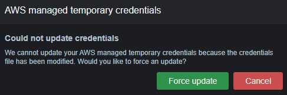
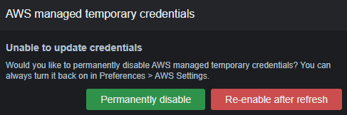
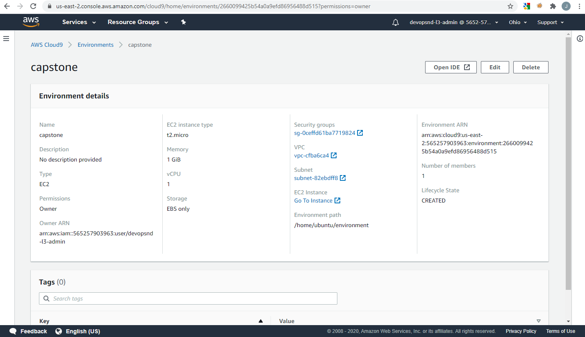
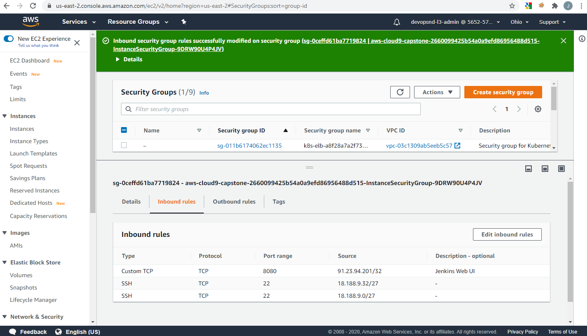

# Kubernetes CI/CD on AWS

## Prerequisites

For this project, you will need

- an AWS account

## Get started

### Set up Cloud9 and install the necessary software on it.

- Create a Cloud9 coding environment. You can choose any instance size (I used the t2.micro which is free-tier eligible),
  but please make sure it runs Ubuntu (not Amazon Linux).
- Enter your own AWS credentials with `aws configure` (e.g. the ones associated with the IAM user you used for creating the Cloud9 environment). When prompted, click cancel 
  (do not force a credentials update which would give you another set of temporary credentials) and then "disable permanently" (this will prevent AWS from 
  overwriting your credentials with yet another set of temporar ones). Otherwise, you could run into problems with the EKS cluster if you have temporary credentials.

Click "cancel" here.

Click "permanently disable" here.

- Configure the Cloud9 EC2 instance's security group to allow Custom TCP access from your IP address on port 8080 (this will be used to access Jenkins in a browser).

Click on the security group.

Add an inbound rule: Custom TCP, port 8080, My IP, description: Jenkins Web UI

- Clone this repository into your Cloud9 instance with `git clone https://github.com/jgarrels/aws-kubernetes-ci-cd` and go into the folder with `cd aws-kubernetes-ci-cd`.
- Run `make setup` to configure the EBS storage size, create the EKS cluster, install and start Jenkins and other dependencies. If you get an error, run `make setup` again and 
  it should run without problems. Should you need to run the make steps included in setup separately, it is important that you run `make setup-ebs-size` first.

### Set up Jenkins in the Web UI and run the pipeline

- Use the output from `make setup-jenkins` (the last step in `make setup` - its output should be displayed as the last thing in the terminal):
  go to the public DNS address for the Jenkins interface displayed (something starting with ec2- and ending with :8080)
  and enter the alphanumeric initial password displayed.
- Set up Jenkins: Choose "Install suggested plugins", then create an admin user.
  Go to "Manage Jenkins" -> "Manage plugins" -> "Available" and install "Blue Ocean - Blue Ocean Aggregator", "Pipeline: AWS steps", "Docker" and "Docker build steps".
- Go to "Manage Jenkins" -> "Manage Credentials" -> "(global)" and add your AWS credentials as AWS credentials with ID "aws" 
  and your DockerHub credentials as "Username with Password" and ID "docker".
- Go back to the Jenkins landing page and click on "Blue Ocean" in the sidebar on the left.
- Create a pipeline: create a GitHub token, select the repository and create the pipeline (you might need to fork or clone this repo into your GitHub).
- Go to the classic Jenkins view, to the pipeline, and under "Configure" set "Scan Repository Triggers" to something reasonable (e.g. 2 minutes for demo purposes).
- Wait for the pipeline to run and view the resulting logs, especially for the last step. The load balancer's DNS name will be there.
  Copy the LB DNS into a new browser tab. You should now see the website saying something like "Hi there!".

### Clean up

If you don't want to have a lot of charges for EC2 instances and NAT gateways etc., you should clean up after you did this demo.
- Go to the EKS page and delete the clusters.
- Go to the CloudFormation page and delete the stacks pertaining to the EKS cluster (starting with `eksctl-`). Some resources might need to be deleted manually 
  should you run into a delete error. After deleting those manually, you can retry to delete the stack (it will prompt you to skip those difficult ones, which you 
  should do - the stack is then simply deleted).
- Finally, you can delete the Cloud9 instance from the Cloud9 dashboard.

## Project description

This project deploys an application into a Kubernetes cluster on AWS, using the CI/CD tool Jenkins and the cloud-native development environment AWS Cloud9.

### Choice of technologies

### Further scope for automation

